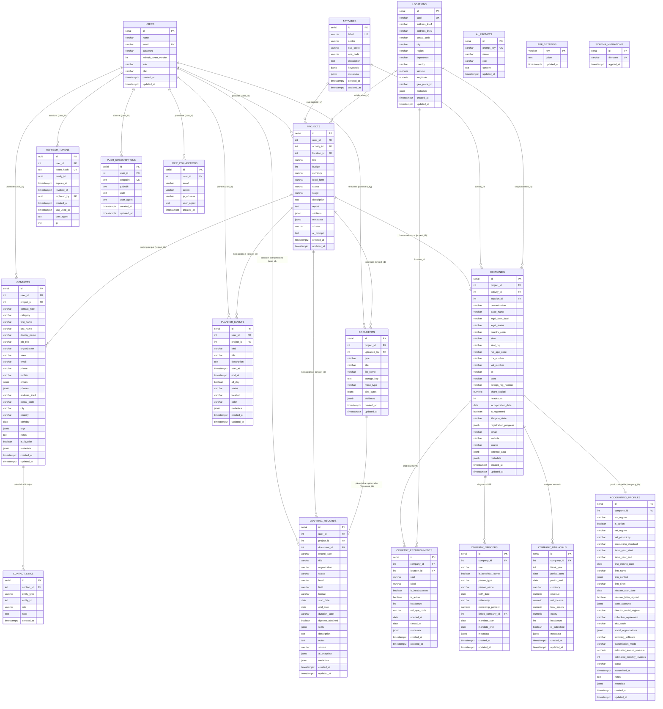

# Schéma de la base de données — Kizumai

Ce document est la représentation versionnée du schéma PostgreSQL.
La **source de vérité** reste les migrations : `backend/src/database/migrations/*.sql`.

## Comment l'éditer

- **GitHub / VS Code** : le diagramme Mermaid ci-dessous se rend automatiquement sur
  GitHub. Dans VS Code, installer l'extension *Markdown Preview Mermaid Support* (ou
  *Mermaid Preview*), ou éditer en ligne sur [mermaid.live](https://mermaid.live).
- **dbdiagram.io** : importer `docs/db-schema.dbml` (gratuit, éditeur visuel + DSL).

## Diagramme

## Règles de suppression (ON DELETE)

| Relation | Règle |
|---|---|
| `users → projects` | CASCADE |
| `users → refresh_tokens` | CASCADE |
| `projects → documents` | CASCADE |
| `users → push_subscriptions` | CASCADE |
| `users → planner_events` | CASCADE |
| `projects → planner_events` | SET NULL |
| `users → contacts` | CASCADE |
| `projects → contacts` | SET NULL |
| `contacts → contact_links` | CASCADE |
| `{project,document,planner_event,company} → contact_links` | CASCADE (trigger, `entity_id` polymorphe) |
| `users → learning_records` | CASCADE |
| `projects → learning_records` | SET NULL |
| `documents → learning_records` | SET NULL |
| `activities → projects` | SET NULL |
| `locations → projects` | SET NULL |
| `users → documents` (uploaded_by) | SET NULL |
| `users → user_connections` | SET NULL |
| `projects → companies` | CASCADE |
| `companies → company_establishments` | CASCADE |
| `companies → company_officers` | CASCADE |
| `companies → company_financials` | CASCADE |
| `activities/locations → companies` | SET NULL |
| `companies → accounting_profiles` | CASCADE |
| `projects → project_memory_nodes` | CASCADE |
| `projects → project_memory_edges` | CASCADE |
| `projects → project_memory_snapshots` | CASCADE |
| `project_memory_nodes → edges` | CASCADE |

## Contraintes CHECK

- `users.plan` ∈ `{ free, paid }`
- `projects.status` ∈ `{ draft, active, paused, launched, archived }`
- `projects.stage` ∈ `{ idee, etude_marche, business_plan, financement, immatriculation, lancement }`
- `companies.lifecycle_state` ∈ `{ projet, en_creation, immatriculee, active, suspendue, cessee }`
- `companies.legal_status` ∈ `{ active, dormant, dissoute, radiee, liquidation }`
- `company_officers.person_type` ∈ `{ physique, morale }` · `ownership_percent` ∈ `[0, 100]`
- `accounting_profiles.status` ∈ `{ brouillon, pret, transmis }` · `accounting_standard` ∈ `{ PCG, IFRS, OTHER }`
- `accounting_profiles.tax_regime` ∈ `{ IS, IR_BIC, IR_BNC, micro }` · `vat_regime` ∈ `{ franchise, reel_simplifie, reel_normal, none }`
- `planner_events.kind` ∈ `{ task, deadline, appointment, reminder }` · `status` ∈ `{ todo, in_progress, done, cancelled }` · `end_at ≥ start_at`
- `contacts.contact_type` ∈ `{ person, company }` · `preferred_channel` ∈ `{ email, phone, mobile }`
- `contact_links.entity_type` ∈ `{ project, document, planner_event, company }` · unique `(contact_id, entity_type, entity_id)`
- `learning_records.record_type` ∈ `{ formation, diplome, etude, bilan_competences }`
- `learning_records.status` ∈ `{ envisage, en_cours, termine, abandonne }`
- `learning_records.format` ∈ `{ en_ligne, presentiel, mixte }` · `source` ∈ `{ manual, ai_suggestion, import }`
- `learning_records.end_date ≥ start_date` (si les deux sont renseignés)
- `project_memory_nodes.node_type` ∈ `{ fact, decision, event, task_state, milestone, insight, risk }`
- `project_memory_edges.relation_type` ∈ `{ causes, depends_on, blocks, relates_to, follows, contradicts, reinforces }`
