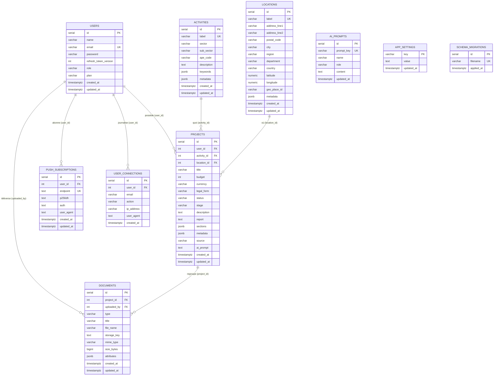

# Schéma de la base de données — Kizumai

Ce document est la représentation versionnée du schéma PostgreSQL.
La **source de vérité** reste les migrations : `backend/src/database/migrations/*.sql`.

## Comment l'éditer

- **GitHub / VS Code** : le diagramme Mermaid ci-dessous se rend automatiquement sur
  GitHub. Dans VS Code, installer l'extension *Markdown Preview Mermaid Support* (ou
  *Mermaid Preview*), ou éditer en ligne sur [mermaid.live](https://mermaid.live).
- **dbdiagram.io** : importer `docs/db-schema.dbml` (gratuit, éditeur visuel + DSL).

## Diagramme

## Règles de suppression (ON DELETE)

| Relation | Règle |
|---|---|
| `users → projects` | CASCADE |
| `projects → documents` | CASCADE |
| `users → push_subscriptions` | CASCADE |
| `activities → projects` | SET NULL |
| `locations → projects` | SET NULL |
| `users → documents` (uploaded_by) | SET NULL |
| `users → user_connections` | SET NULL |

## Contraintes CHECK

- `users.plan` ∈ `{ free, paid }`
- `projects.status` ∈ `{ draft, active, paused, launched, archived }`
- `projects.stage` ∈ `{ idee, etude_marche, business_plan, financement, immatriculation, lancement }`
